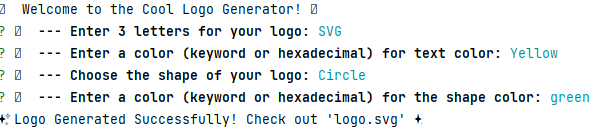
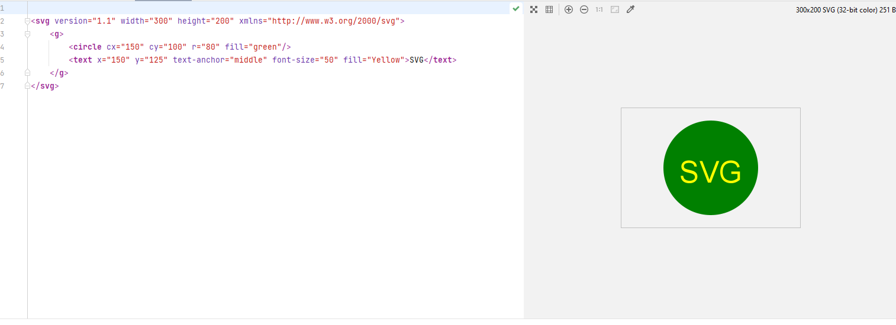

# SVG Logo Maker

SVG Logo Maker is a simple tool that allows you to generate SVG logos with customizable text and shapes. It can be run both in a browser-like environment and Node.js.

## Table of Contents

- [Features](#features)
- [Installation](#installation)

## Features

- Create logos with custom text, text color, shapes, and shape color.
- Supports three shapes: circle, triangle, and square.
- Generates SVG logos and saves them as PNG images.
- 

## Installation

Make sure you have Node.js and npm installed on your machine.

```bash
npm install 
npm i inquirer@8.2.4
npm i jest
